# web api the good parts

## HTTP Method

|Method|描述|幂等性|
|---|---|---|
|GET|获取资源|Y|
|POST|创建资源|N|
|PUT|更新已有的特定资源的全部信息，payload为全部信息|Y|
|PATCH|更新已有的特定资源的部分信息，payload为局部信息|Y|
|DELETE|删除资源|Y|
|HEAD|同GET，但是返回体无Body|Y|

> 幂等性 https://developer.mozilla.org/zh-CN/docs/Glossary/Idempotent

使用POST方式来伪装其他方法例如DELETE的方式：
- 使用 X-HTTP-METHOD-OVERRIDE: DELETE
- 在URI中，添加查询参数 _method=delete


## basic user

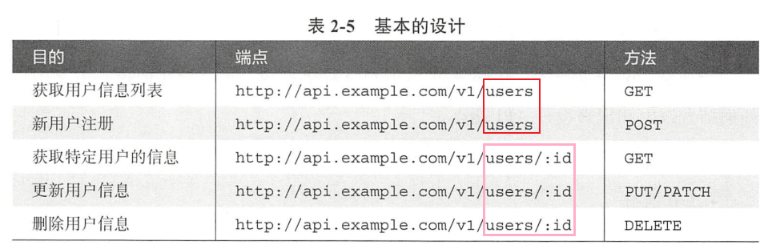

这里只有2个端点，users 和 users/:id, 分别表示用户集合和单独用户，对应数据库的表和表中的一行记录。

将数据集合和单独的数据以端点的形式来语义化表示，并使用HTTP方法对其进行操作，正是Web API设计的基础。


## 好友关系

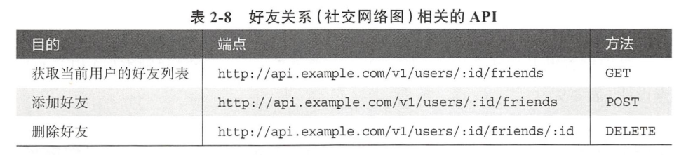


## 动态信息

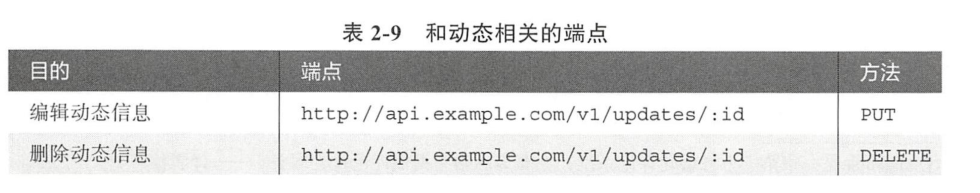

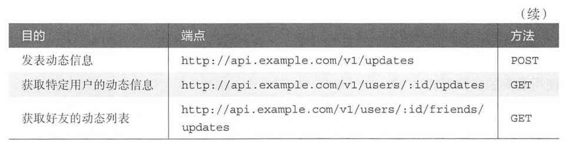


## 查询参数

- 相对位置：从什么地方(offset)开始的多少条(limit)
- 绝对位置：在某个时间点之后的数据。

由于不应该一次性获取完整的数据集合，因此需要分页，对应着查询参数。

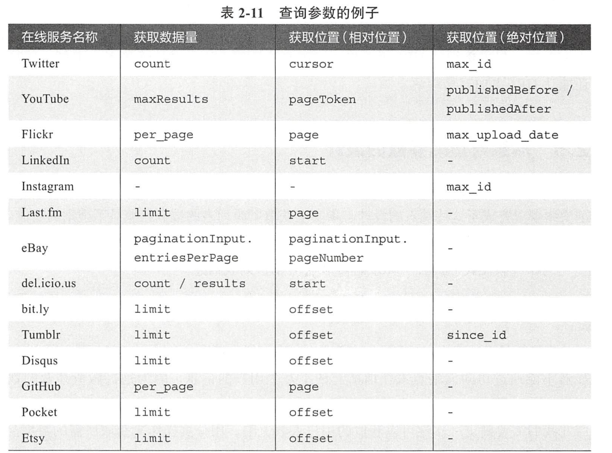

## 查询参数和路径的使用区别

- 跟资源唯一性无关的，使用查询参数。例如accessToken。
- 跟资源唯一性有关，使用路径。例如用户ID。


## OAuth 2

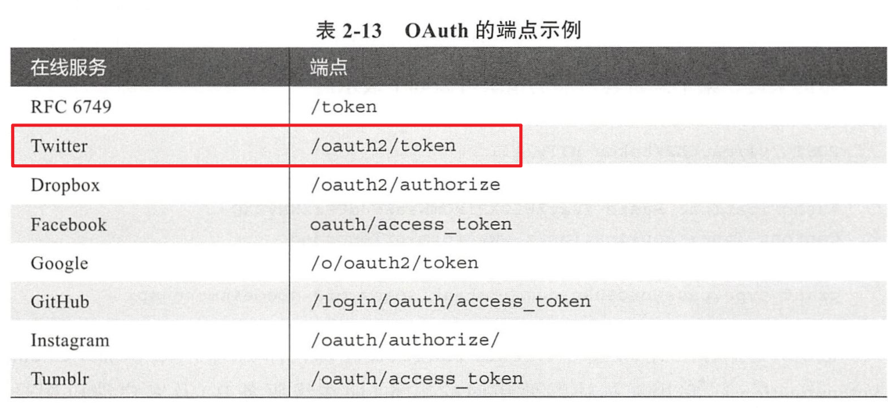


## 获取已登录用户的自身信息

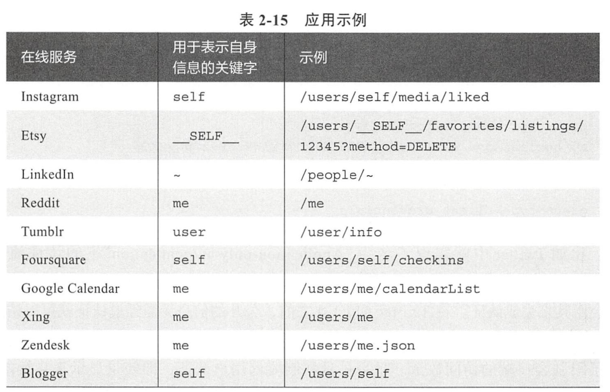


## HATEOAS

HATEOAS在API返回的数据响应中，包含了客户端下一步可能要执行的行为的URI的补充信息。


## 数据格式的指定

- 在查询参数中声明，例如 users?format=xml
- 在路径中指定文件格式后缀，例如 users.json
- 使用名为Accept的请求头部：Accept: application/json

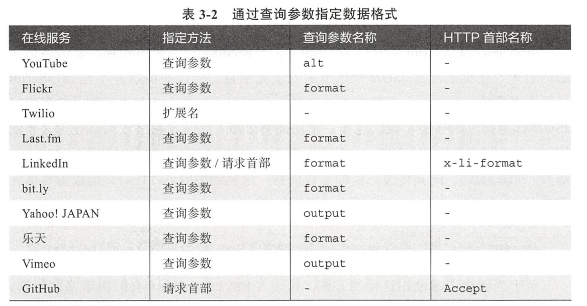


## JSONP

格式：

```
callback({data: 123})
```

当使用script元素读取该js代码片段时，类似于真实的函数调用。因此，只要预先声明这个callback函数的实现即可。通过这个callback来接收数据，然后执行。

历史原因：xmlhttprequest有同源策略的限制，而script没有这个限制。因此，script元素将JSON数据当作js来读取执行，达到跨域目的。


## 让用户选择响应的内容

查询参数：?fields=name,age

> 另一个选择 GraphQL


## 响应中的错误信息

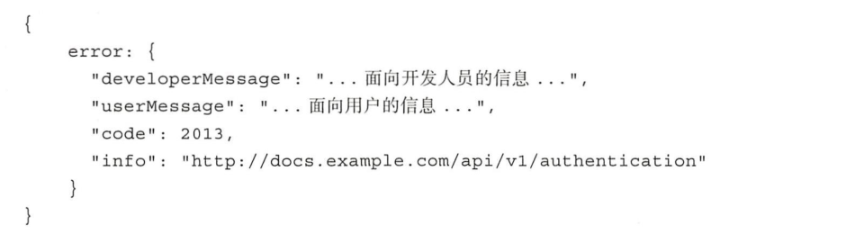


## HTTP status code

- 401 Unauthorized 没有认证：我不知道你是谁

- 403 Forbidden 没有授权：我知道你是谁，但你没有权限

  

## 浏览器缓存

- Expires + 绝对日期
- cache-control +相对日期
- ETag 表示某个资源的指纹，一旦资源改变，那么这个指纹就会改变。本质就是字符串标志。

客户端询问方式

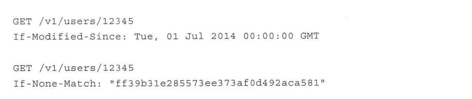

ETag指纹有强弱之分，W前缀标识。强指纹一致指的是字节码绝对一致。弱指纹一致指的是逻辑上一致就可以，文件变化也没有关系。


## 强制不使用缓存

Cache-Control： no-cache或者no-store


## 使用Vary来指定缓存单位

当服务器不知道中间代理服务器是否存在时，最好启用这个策略。

Github为例

```
Vary: Accept, Authorization, Cookie
```


## 新旧API渐进

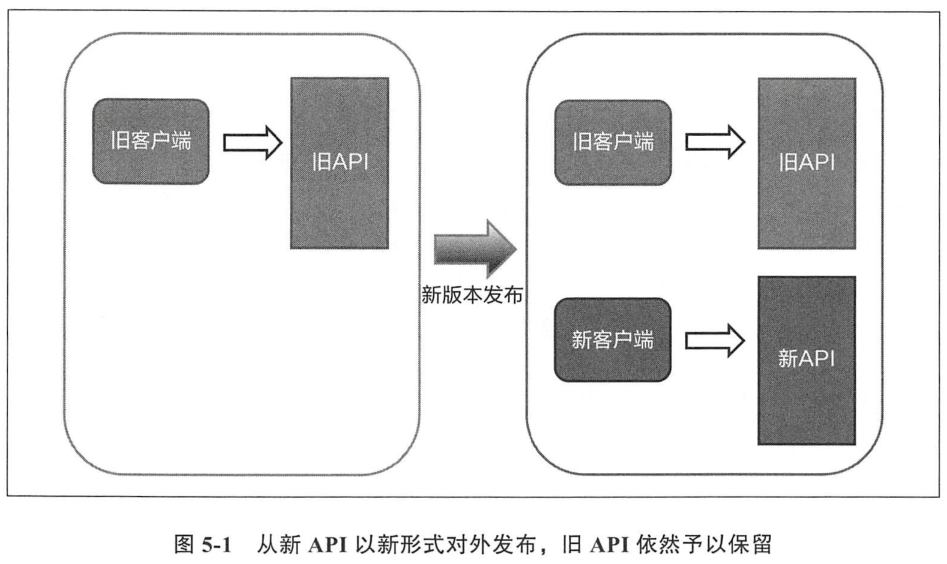

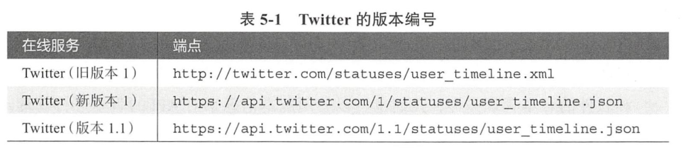

在不指定v？路径时，考虑是否支持访问，如果支持，此时访问的是最早的版本还是最新的版本呢？

### 多个API版本的维护与废弃

同时维护多个API版本不太现实，例如同时维护v1,v2,v3,v4版本。

正常情况下，维护2或3个版本是可以接受的。而在合适的时机，应该大胆地宣布要废弃过旧的API版本。举例，在API V4发布时，可以考虑废弃v1或者v2。

不过，在计划废弃API版本前，必须先宣布比较明确的废弃计划和废弃时间，给予足够时间给下游应用来应对变更。


## 限流

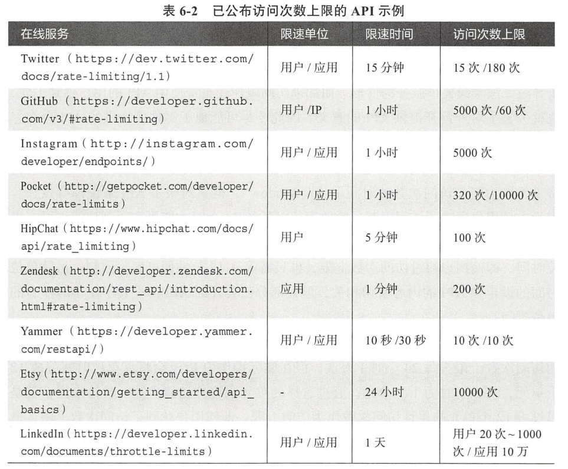

github为例：

```json
// 20220628152619
// https://api.github.com/rate_limit

{
  "resources": {
    "core": {
      "limit": 60,
      "remaining": 59,
      "reset": 1656402945,
      "used": 1,
      "resource": "core"
    },
    "graphql": {
      "limit": 0,
      "remaining": 0,
      "reset": 1656404780,
      "used": 0,
      "resource": "graphql"
    },
    "integration_manifest": {
      "limit": 5000,
      "remaining": 5000,
      "reset": 1656404780,
      "used": 0,
      "resource": "integration_manifest"
    },
    "search": {
      "limit": 10,
      "remaining": 10,
      "reset": 1656401240,
      "used": 0,
      "resource": "search"
    }
  },
  "rate": {
    "limit": 60,
    "remaining": 59,
    "reset": 1656402945,
    "used": 1,
    "resource": "core"
  }
}
```

其中rate项是为了兼容旧API而保留的，不久将会废弃。


## 沙盒API测试

例如paypal提供沙盒测试环境，测试账号可以随意测试金额增减。


