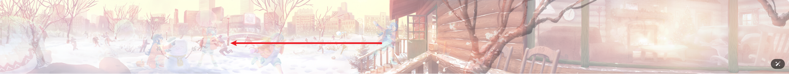

# 实现说明

## 目标示意图


## 初始状态

初始状态：

|               | 早上场景 | 中午场景 | 晚上场景 |
|---------------|------|------|------|
| z-index(init) | 0    | 10   | 20   |
| opacity(init) | 1    | 1    | 0    |
| visual result | 🙈   | 👁️  | 🙈   |

初始时，中午的场景为可见状态。
假设鼠标初始位置为 banner div 宽度方向（x -axis）的中心：

- 鼠标向左平移时，场景向上午过渡，鼠标完全达到 banner div 左边缘时，过渡完成。
- 鼠标向右平移时，场景向晚上过渡，鼠标完全达到 banner div 右边缘时，过渡完成。

这个 X 方向上的平移，顺着直觉建模为一个变量 deltaX，类型为 float。

## 场景摆放

上面没有仔细考虑场景素材的摆放，而是以【XX 场景】概述，这里将进行说明。

很明显，布置不同时间段场景的父容器可以采用绝对布局（absolute），而三个时间段（早上、中午、晚上）的场景素材可以按照分类放入对应分类的父容器中。

素材也采用绝对布局（absolute）来进行 z 方向上的层叠。例如，树的父容器 div 内部，可以放入三个 img，这三个 img 使用 class 区分时间段。

示意代码如下：

```html

<div class="tree">
    
    
    
</div>
```

根据这个思路，我们就可以先去搜集素材了，将原网站素材下载到本地。一番梳理过后，可以得到这样的内容结构：

```html

<div class="banner" style="--deltaX: 0.5;">
    <div class="scene">
        
        
        <!-- 这是 22 和 33 正在玩耍的小雪球 -->
        
        <!-- 本来晚上的场景应该也是图片，但是换成了更加生动的短视频 -->
        <!--        -->
        <video autoplay="autoplay" loop="loop" muted="muted" class="evening">
            <source src="" type="video/webm">
        </video>
        <!-- 这是右侧屋子的窗户框 -->
        
    </div>
    <div class="tree">
        
        
        
    </div>
</div>
```

scene 和 tree 的 div 为绝对布局，内部的素材（img 或者 video 等等）一律也是绝对布局。

## 鼠标移动

我们先在 js 中记录鼠标移动距离以及计算 deltaX 的变化。

```js
let startingPoint = 0
const header = document.querySelector('.banner')

header.addEventListener('mouseenter', (e) => {
    startingPoint = e.clientX
    header.classList.add('moving')
})

header.addEventListener('mouseout', (e) => {
    header.classList.remove('moving')
    header.style.setProperty('--deltaX', 0.5)
})

header.addEventListener('mousemove', (e) => {
    // 设定 banner 的整体宽度为一个单位长度，即 1
    // 左平移 0.5 单位，例如从中间移动到左边缘
    // 左平移 1 单位，例如从右边缘移动到左边缘
    // 右平移 0.5 单位，例如从中间移动到右边缘
    // 右平移 1 单位，例如从左边缘移动到右边缘
    //       长度为 0.5     中心点     长度为 0.5
    // |---------------------|----------------------|
    //   鼠标左移，场景右移 
    // 0.5 <-----------------
    // 1 <------------------------------------------
    //                              鼠标右移，场景左移
    //                       ---------------------> -0.5
    // -------------------------------------------> -1

    // 1. 我们设定平移 0.5 个单位长度时，就能完全使得 opacity 从 0 变化到 1。在继续平移使得 opacity 溢出后，即使 opacity 的值超出 [0,1] 范围，
    // 浏览器也会自动截断，例如 opacity = 2 等效于 1，opacity 为 -1 等效于 0.
    // 2. 场景素材移动的方向和鼠标移动的方向相反。
    // 3.banner 视口固定，过渡到早上时，由于场景素材的右移，如果早上的场景素材不准备足够的右移缓冲距离，那么左侧会发生小幅度的空白区域。
    // 所以早上场景的素材摆放初始位置时，需要往左偏移一段距离，例如 100px。同理，晚上的场景素材也需要准备足够的位移距离，提供给场景左移。这个细节可以延后再处理。

    // or use header.offsetWidth(border+padding+content)
    let deltaX = (startingPoint - e.clientX) / header.clientWidth
    // deltaX = [1,-1]
    header.style.setProperty('--deltaX', deltaX)
})
```

我们已经在 js 中记录了 deltaX 的变化，接下来就是利用这个 deltaX 来处理对应素材的 opacity 和 translatex。

## opacity 过渡

接下来是公式的推导。

为了关注点分离，先不考虑 translate 平移，只考虑 opacity 过渡。

- `deltaX` 往 +0.5 方向走时，代表向早上过渡；往 -0.5 方向走时，代表往晚上过渡。

deltaX 初始值可认为等于 0。因为鼠标刚进入时，x 偏移量很小。此时

| deltaX       | +0.5         | 0(初始)  | -0.5         |
|--------------|--------------|--------|--------------|
| 早上素材 opacity | 0->1(渐变)     | 0      | ~~0->0(不变)~~ |
| 中午素材 opacity | 1->0(渐变)     | 1      | 1->0(渐变)     |
| 晚上素材 opacity | ~~0->0(不变)~~ | 0      | 0->1(渐变)     |
| result       | 显示早上场景       | 显示中午场景 | 显示晚上场景       |

自变量是 deltaX，我们的目标是求出三个时间段素材的 oapcity 随 deltaX 变化的公式

```
早上素材 opacity(deltaX) =?
中午素材 opacity(deltaX) =?
晚上素材 opacity(deltaX) =?
```

早上素材 opacity(deltaX) = max(0,min(1,2⋅deltaX))

说明：

- deltaX 和 oapcity 之间的关系很明显是线性相关，如果严谨来分析，可以设 K 值来求出 K=2。
- 使用 min(1, 2 * deltaX) 来确保透明度不会超过 1，即 <=1。
- 使用 max(0, ...) 来确保透明度不会低于 0，即 >=0。

按照这个思路，中午和晚上素材 opacity 的公式就可以简单求出了。

- 中午素材 opacity(deltaX)=1−∣2⋅deltaX∣ (当−0.5≤deltaX≤0.5)
- 全范围，中午素材 opacity(deltaX)=max(0,min(1,1−∣2⋅deltaX∣))

---

- 晚上素材 opacity(deltaX)=−2⋅deltaX (当−0.5≤deltaX<0)
- 全范围，晚上素材 opacity(deltaX)=max(0,min(1,−2⋅deltaX))

---

公式求出来后，最直接的方式就是使用 js 来实现：

- a) JS 逻辑计算并设置相应 opacity。这种方式侵入了样式的表示，代码不够优秀。
- b) JS 来计算公式的值，不参与样式设置。样式 opacity 的最终设置交给 CSS opacity 属性。这个方式是优雅的。

现在，我们的 js 是这样：

```js
    let startingPoint = 0
    const header = document.querySelector('.banner')

    header.addEventListener('mouseenter', (e) => {
        startingPoint = e.clientX
        header.classList.add('moving')
    })

    header.addEventListener('mouseout', (e) => {
        header.classList.remove('moving')
        // reset css variables
        header.style.setProperty('--deltaX', 0.5)
        header.style.setProperty('--morning-opacity', 0)
        header.style.setProperty('--afternoon-opacity', 1)
        header.style.setProperty('--evening-opacity', 0)
    })

    header.addEventListener('mousemove', (e) => {
        let deltaX = (startingPoint - e.clientX) / header.clientWidth
        // update css variables
        header.style.setProperty('--deltaX', deltaX)
        header.style.setProperty('--morning-opacity', Math.max(0, Math.min(1, 2 * deltaX)))
        header.style.setProperty('--afternoon-opacity', Math.max(0, Math.min(1, 1 - Math.abs(2 * deltaX))))
        header.style.setProperty('--evening-opacity', Math.max(0, Math.min(1, -2 * deltaX)))
    })
```

K=2 这个表示需要走 0.5 单位长度才能完全过渡完毕，如果嫌慢，可以适当增大这个值。
例如 4。此时 1/4=0.25, 即走 0.25 单位长度就可以过渡完毕。

## 修复早上场景在过渡时泛白


这个原因在于早上场景的素材在初始状态是 opacity=0，而且早上雪景本身偏白。早上 - 中午场景过渡期间，一旦中午场景 opacity 也降低到一定程度，
此时页面这个区域整体 opacity 非常低，于是画面泛白。修复方式就是，让早上场景素材的初始状态为 opacity=1。同时，中午场景向早上过渡时，维持早上场景的 opacity=1 不变。

于是，需要做如下改动。

```js
header.addEventListener('mouseout', (e) => {
    // ...
    header.style.setProperty('--morning-opacity', 1)
})

header.addEventListener('mousemove', (e) => {
    // ...
    header.style.setProperty('--morning-opacity', (deltaX > 0) ? 1 : 0)
})
```

## 让鼠标退出后过渡更加自然

此时，在鼠标退出 banner 时，场景会一下子变回初始的中午状态，这样非常突兀。为了让过渡更加自然，可以向素材标签添加 css
transition。

```css
.morning {
    transition: 0.2s all ease-in;
    z-index: 0;
    opacity: calc(var(--morning-opacity));
}

.afternoon {
    transition: 0.2s all ease-in;
    z-index: 10;
    opacity: calc(var(--afternoon-opacity));
}

.evening {
    transition: 0.2s all ease-in;
    z-index: 20;
    opacity: calc(var(--evening-opacity));;
}
```

此时又会产生一个问题，就是鼠标在 banner 内部正常平移时，也应用了 transition，可以通过利用.moving css 类标记来识别这个时间段，并取消此时间段的 css transition：
```css
.banner {
    &.moving {
        .afternoon,
        .evening,
        .ball,
        .view,
        .tree {
            /* 鼠标正在移动时，不要应用过渡 */
            transition: none;
        }
    }
}
```

另一个思考点：纯 CSS 能否处理这个公式的表达，使用 `calc()`。

## translatex 平移

- 场景素材的移动需要区分前景和背景，前景移动幅度稍大，背景移动幅度稍小。
- 素材的移动通过 `transform: translatex` 来实现，具体移动的值由 js 计算并挂载到 div 属性。

在这里，需要移动的是 scene，tree，以及 ball。
```css
.scene {
}

.tree {
    filter: blur(3px);
}

.ball {
    z-index: 10;
    opacity: calc(var(--ball-opacity));
}
```
我们还是列表进行分析：
- `deltaX` 往 +0.5 方向走时，代表向早上过渡；往 -0.5 方向走时，代表往晚上过渡。
- deltaX 初始值可认为等于 0。因为鼠标刚进入时，x 偏移量很小。

| deltaX             | +0.5 | 0(初始) | -0.5 |
|--------------------|------|-------|------|
| .scene(translateX) |      | 0     |      |
| .tree(translateX)  |      | 0     |      |
| .ball(translateX)  |      | 0     |      |
| result             | 素材右移 | 固定    | 素材左移 |

我们可以往 +0.5 这一列填入 ` 正整数 *deltaX`，例如 `deltaX*100`，`delta*150` 等等。系数大小取决于景别。

而 -0.5 这一列也可以填入 ` 正整数 *deltaX`，因为符号已经由 deltaX 提供。系数按照景别保持一致即可。

关键代码如下：
```js
    header.addEventListener('mouseout', (e) => {
        // ...
        header.style.setProperty('--sceneTransformX', 0)
        header.style.setProperty('--treeTransformX', 0)
        header.style.setProperty('--ballTransformX', 50)
        header.style.setProperty('--ballRotateDegree', 10)
    })

    header.addEventListener('mousemove', (e) => {
        // 末尾的 + 的是 initial 值
        let sceneTransformX = deltaX * 100 * 1.2
        let treeTransformX = deltaX * 150 * 2
        let ballTransformX = deltaX * 100 + 50
        let ballRotateDegree = deltaX * 10 * 2 + 10
        header.style.setProperty('--sceneTransformX', sceneTransformX)
        header.style.setProperty('--treeTransformX', treeTransformX)
        header.style.setProperty('--ballTransformX', ballTransformX)
        header.style.setProperty('--ballRotateDegree', ballRotateDegree)
    })
```

XXXtransformX 的值都由 deltaX 计算得来，以 sceneTransformX 为例说明， `let sceneTransformX = deltaX * 100 * 1.2`
中 `100 * 1.2` 是什么含义，怎么考虑得出的？
- 100 这里是作为一个位移量级的 unit，因为 scene 的移动幅度较小，这里就取了较小的值。对于前景 tree，就可以取 150 或者 200。
- 1.2 这里表示的是一个调节系数，这个值一开始是 1。因为具体调整效果时，发现幅度偏小，于是稍微增大到 1.2。
- 后面的值`* N`也是同样的道理。
- 需要注意的是 `let ballTransformX = deltaX * 100 + 50`中 50是初始偏移，这个初始值一定要在 `mouseout`事件中设置。

## 鼠标退出后位移复位+渐变还原
```css
.scene,
.tree {
    position: absolute;
    top: 0;
    right: 0;
    bottom: 0;
    left: 0;
    display: flex;
    justify-content: center;
    align-items: center;
    /*这个设置很关键，如果没有的话，鼠标退出后，是直接渐变复原，加上这个是位移+渐变复原*/
    transition: 0.2s all ease-in;
}
```

## 下雪动画 

这个在前端一般是通过canvas来实现。可以参考网上一些开源的库或者教程。


## 参考

- https://ainyi.com/101
- http://ainyi.com:7654/my-transfer/#/index